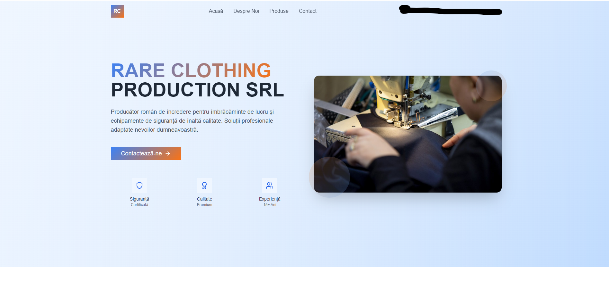

<!-- Badges row -->
<p align="center">
  <a href="https://github.com/mcapostol/Rare-Clothing-Web/actions/workflows/ci.yml">
    
  </a>
  <a href="https://github.com/mcapostol/Rare-Clothing-Web/actions/workflows/codeql.yml">
    
  </a>
  
</p>

<h1 align="center">Rare Clothing – E‑commerce Frontend</h1>

Single‑page web shop for the **Rare Clothing** brand. Built for ⚡ **speed** (Vite + Tailwind) and 💧 **flexibility** (API‑ready components, headless friendly).

<!-- live -->
<p align="center">
  <a href="https://mcapostol.github.io/Rare-Clothing-Web/" target="_blank">🌐 Live demo</a>
</p>

<!-- screenshot -->
<p align="center">
  
</p>

## Tech stack

| Layer | Choice |
|-------|--------|
| Framework | Vite + React 18 |
| Styling | TailwindCSS + HeroIcons |
| CI / CD | GitHub Actions → ACR → AKS (Helm) |
| Testing | Vitest + React Testing Library |
| Security | Dependabot + CodeQL |

## Features

- 🛒 **Product grid** with responsive Masonry layout  
- 🛍️ **Cart context** stored in `localStorage`  
- 🔎 Instant search (Fuse.js)  
- 🌙 Dark mode toggle  
- **PWA ready** (`vite-plugin-pwa`)  

## Roadmap 🚀

- [x] Product listing & cart context  
- [x] GitHub Actions CI (lint, unit tests)  
- [ ] Dockerfile multistage + push to ACR  
- [ ] Helm chart & Ingress (dev namespace)  
- [ ] Stripe checkout integration  
- [ ] Lighthouse score > 95 mobile  

## Quick start

```bash
git clone https://github.com/mcapostol/Rare-Clothing-Web
npm i
npm run dev               # http://localhost:5173
```

## Scripts

| Command | Purpose |
|---------|---------|
| `npm run dev` | Start Vite dev server |
| `npm run test` | Run unit tests (Vitest) |
| `npm run build` | Build production bundle |
| `npm run preview` | Preview dist build locally |

## License

[MIT](LICENSE)
